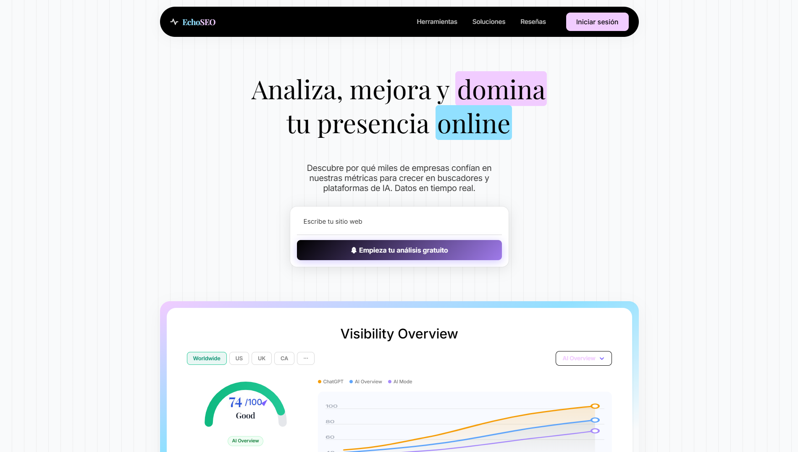
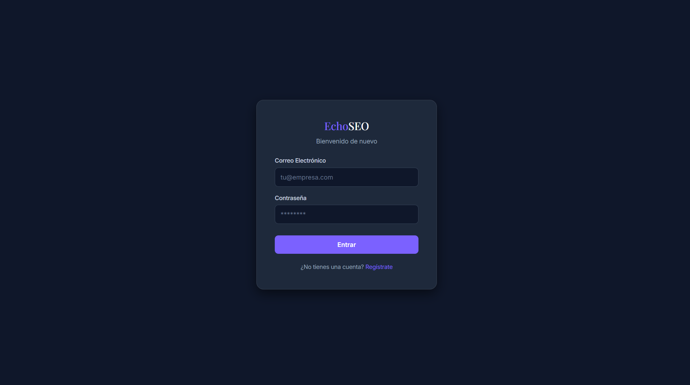
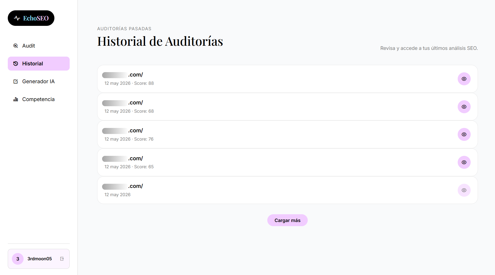
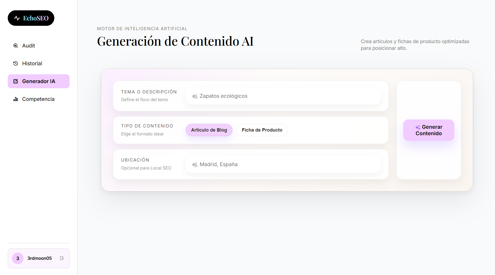
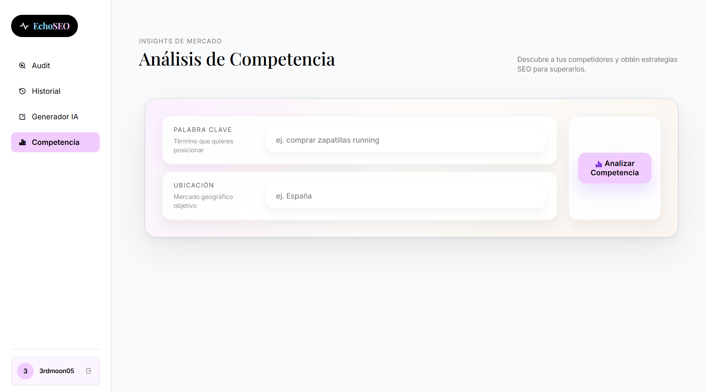

<p align="center">
  
</p>

<p align="center">
  <strong>La plataforma líder de SEO e IA</strong> — Aplicación web full-stack para auditorías SEO automatizadas, generación de contenido con inteligencia artificial y análisis de competidores.
</p>

> Proyecto final de DAW II — Fabian & Joel

---

## Descripción general

EchoSEO permite a los usuarios analizar cualquier URL y obtener una auditoría SEO completa, recomendaciones, contenido generado por IA e inteligencia competitiva, todo desde un único panel de control.



---

## Funcionalidades

| Funcionalidad | Descripción |
|---|---|
| **Auditoría SEO** | Analiza una URL y devuelve una puntuación SEO detallada con informe completo |
| **Historial de auditorías** | Almacena las auditorías anteriores por usuario con paginación y exportación a PDF |
| **Generador de contenido IA** | Crea contenido optimizado para SEO según tema, tipo y localización |
| **Análisis de competidores** | Compara visibilidad de palabras clave y posicionamiento frente a competidores |
| **Autenticación** | Registro e inicio de sesión seguros con hash bcrypt de contraseñas |
| **Interfaz responsiva** | Diseño mobile-first con visualizaciones interactivas usando Canvas API |

---

## Stack tecnológico

### Frontend
- **HTML5 / CSS3 / JavaScript (ES6+)** puro (sin frameworks)
- [RemixIcon](https://remixicon.com/) — librería de iconos
- Google Fonts — Playfair Display, Inter
- **Fetch API** nativa y **Canvas API**
- **localStorage** para persistencia de sesión

### Backend
- **PHP** (vanilla, sin framework) — API REST
- **SQLite** — base de datos mediante PDO
- Arquitectura Service / DAO

### Microservicio SEO
- Servicio externo en **Python** (puerto `8000`) que realiza el procesamiento SEO pesado
- Consumido vía HTTP tanto desde el frontend como desde el backend

---

## Arquitectura

```
┌─────────────────────┐        ┌──────────────────────┐
│   Frontend (HTML)   │◄──────►│  Backend (PHP + PDO) │
│   frontend/app/     │        │  backend/api/        │
└─────────────────────┘        └──────────┬───────────┘
                                           │
                                ┌──────────▼───────────┐
                                │  Base de datos       │
                                │  SQLite              │
                                └──────────────────────┘

El frontend también llama directamente a:
┌─────────────────────┐        ┌──────────────────────┐
│   Frontend (HTML)   │◄──────►│  Microservicio Python│
│   pySeoService.js   │        │  localhost:8000      │
└─────────────────────┘        └──────────────────────┘
```

---

## Estructura del proyecto

```
Final-Project-DawII-Fabian-Joel/
├── backend/
│   ├── api/
│   │   ├── auth/
│   │   │   ├── login.php         # POST /api/auth/login
│   │   │   └── register.php      # POST /api/auth/register
│   │   └── seo/
│   │       └── history.php       # GET|POST /api/seo/history
│   ├── config/
│   │   └── database.php          # Conexión PDO SQLite
│   ├── dao/
│   │   ├── UserDao.php
│   │   └── AuditDao.php
│   ├── services/
│   │   └── AuthService.php
│   ├── database/
│   │   └── app_data.sqlite
│   └── scripts/
│       └── init_db.php           # Script de inicialización de la BD
├── frontend/
│   └── app/
│       ├── index.html            # Landing page (pública)
│       ├── login.html
│       ├── register.html
│       ├── dashboard.html        # Aplicación principal (protegida)
│       ├── profile.html
│       ├── company.html          # Sobre nosotros
│       ├── css/
│       │   ├── styles.css
│       │   ├── dashboard.css
│       │   ├── profile.css
│       │   └── aboutUs.css
│       ├── js/
│       │   ├── app.js
│       │   ├── dashboard.js
│       │   ├── profile.js
│       │   └── services/
│       │       ├── authService.js
│       │       └── pySeoService.js
│       └── docs/
│           └── img/              # Capturas y recursos gráficos
└── swagger.json                  # Especificación OpenAPI 3.1.0
```

---

## Primeros pasos

### Requisitos previos

- **PHP 7.4+** con la extensión SQLite (PDO) habilitada
- **XAMPP**, **Laragon** u otro servidor local con soporte PHP (recomendado) — o el servidor integrado de PHP
- **Python 3.x** para el microservicio SEO

### Instalación

**1. Clonar el repositorio**
```bash
git clone https://github.com/Jsanz5/Final-Project-DawII-Fabian-Joel.git
cd Final-Project-DawII-Fabian-Joel
```

**2. Inicializar la base de datos**
```bash
php backend/scripts/init_db.php
```

**3. Servir el proyecto**

**Opción A — XAMPP / Laragon (recomendado)**

Copia o enlaza el proyecto dentro de la carpeta `htdocs` (XAMPP) o `www` (Laragon), arranca Apache y accede desde el navegador a:
```
http://localhost/Final-Project-DawII-Fabian-Joel/frontend/app/index.html
```

**Opción B — Servidor integrado de PHP**

Abre dos terminales y ejecuta cada comando en una:
```bash
# Terminal 1 — backend
php -S localhost:8080 -t backend

# Terminal 2 — frontend
php -S localhost:3000 -t frontend/app
```
Una vez ambos servidores estén corriendo, abre el navegador en `http://localhost:3000`.

> La URL `localhost:3000` solo funciona mientras el servidor PHP esté activo en esa terminal. Si la cierras, la conexión se pierde.

**4. Iniciar el microservicio Python**

El microservicio SEO tiene su propio repositorio: [LugoDv/seo_analysis](https://github.com/LugoDv/seo_analysis)

```bash
git clone https://github.com/LugoDv/seo_analysis.git
cd seo_analysis
# Sigue las instrucciones de instalación de ese repositorio
```

Debe estar accesible en `http://127.0.0.1:8000` para que las funciones de análisis SEO funcionen.

---

## Esquema de base de datos

### Tabla `users`

| Columna      | Tipo     | Descripción                    |
|--------------|----------|--------------------------------|
| `id`         | INTEGER  | Clave primaria autoincremental |
| `email`      | TEXT     | Correo único del usuario       |
| `password`   | TEXT     | Contraseña hasheada con bcrypt |
| `created_at` | DATETIME | Fecha de registro              |

### Tabla `audits`

| Columna       | Tipo     | Descripción                               |
|---------------|----------|-------------------------------------------|
| `id`          | INTEGER  | Clave primaria autoincremental            |
| `user_id`     | INTEGER  | FK → `users(id)`, eliminación en cascada  |
| `url`         | TEXT     | URL analizada                             |
| `seo_score`   | INTEGER  | Puntuación SEO obtenida (0–100)           |
| `report_data` | TEXT     | Informe completo en formato JSON          |
| `created_at`  | DATETIME | Fecha de la auditoría                     |

---

## Referencia de la API

### Autenticación

| Método | Endpoint | Descripción |
|--------|----------|-------------|
| `POST` | `/backend/api/auth/register.php` | Crear una nueva cuenta de usuario |
| `POST` | `/backend/api/auth/login.php` | Autenticar e iniciar sesión |

### Historial SEO

| Método | Endpoint | Descripción |
|--------|----------|-------------|
| `GET`  | `/backend/api/seo/history.php` | Obtener el historial de auditorías del usuario |
| `POST` | `/backend/api/seo/history.php` | Guardar el resultado de una auditoría |

### Microservicio Python (puerto 8000)

| Método | Endpoint | Descripción |
|--------|----------|-------------|
| `POST` | `/seo-analysis/audit` | Ejecutar una auditoría SEO completa sobre una URL |
| `POST` | `/seo-analysis/generate-content` | Generar contenido optimizado con IA |
| `POST` | `/seo-analysis/analyze` | Análisis de palabras clave y competidores |

La especificación completa está disponible en [`swagger.json`](swagger.json).

---

## Capturas de pantalla

### Registro e inicio de sesión




### Dashboard — Auditoría SEO


### Dashboard — Historial



### Dashboard — Generador de contenido IA



### Dashboard — Análisis de competidores



---

## Autores

- **Fabian Lugo** — [GitHub](https://github.com/LugoDv)
- **Joel Otoya** — [GitHub](https://github.com/Jsanz5)

---

## Licencia

Proyecto desarrollado como trabajo final académico del ciclo DAW II. Todos los derechos reservados.
